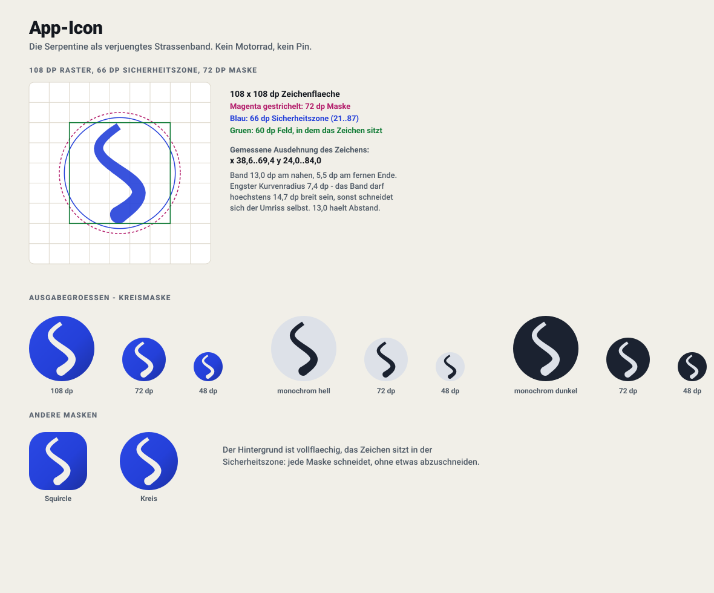

# OpenCurv Design-System

> Zwei Register, ein System. Die App darf Charakter zeigen, solange der Motor
> aus ist. Sobald er läuft, zählt nur noch Lesbarkeit.

Belege ohne Emulator:
[Farbsystem](design/farbsystem.svg) ·
[App-Icon](design/app_icon.svg) ·
[Fahr-HUD](design/bildschirm_hud.svg) ·
[Ruhe-Ansicht](design/bildschirm_ruhe.svg)

Alle Kontrastwerte in diesem Dokument sind nach der WCAG-2.1-Formel für
relative Leuchtdichte gerechnet, nicht geschätzt. Wo eine Fläche halbtransparent
ist, wurde vorher über den ungünstigsten Untergrund gerechnet, den die Karte
liefern kann.

---

## 1. Designhaltung

OpenCurv sieht aus wie eine Landkarte, auf der jemand mit einem guten Stift eine
Linie gezogen hat — nicht wie ein Cockpit-Simulator und nicht wie ein
Fitness-Tracker. Die Karte ist das Produkt; alles andere schwebt darüber und hat
sich dafür zu rechtfertigen. Das Verspielte lebt ausschließlich in den
Ruhezuständen: Onboarding, Regionenliste, Routenvorschau, Kurvigkeitsanzeige —
dort, wo der Fahrer steht, Zeit hat und Lust auf die Tour bekommen soll. Sobald
navigiert wird, kippt dieselbe Palette in ein zweites Register: dunkel, deckend,
riesig, unbewegt. Das ist kein zweites Design, sondern dieselben Tokens in einer
anderen Betriebsart — dieselben Farben, dieselbe Schrift, andere Größen und
andere Deckkraft. Wir orientieren uns an Apple und Google, wo sie recht haben
(weiße Platten, große Radien, blaue Route, ein Blatt statt eines Dialogs), und
weichen ab, wo sie nie auf einem Motorrad saßen (Schatten statt Fassung,
Animation auf Notfallknöpfen, vier Werte in einer Fußleiste). Charakter zeigt
OpenCurv über Bewegung und Farbe in der Ruhe, nie über Dekoration in der Fahrt.
Jede Farbe, jede Größe und jeder Radius hat eine Zahl hinter sich; „sieht gut
aus" ist in diesem Projekt keine Begründung.

**Woran man eine Entscheidung erkennt, die dem widerspricht:**

- Ein Text steht direkt auf der Karte, ohne eigene Fläche darunter.
- Ein schwebendes Element wird nur durch einen Schatten von der Karte getrennt.
- Etwas im HUD bewegt sich, ohne dass der Fahrer die Bewegung ausgelöst hat.
- Ein Notfallknopf (Stopp, Zentrieren, Stumm) reagiert erst nach einer Animation.
- Eine Zahl, die während der Fahrt gelesen wird, ist kleiner als 34 sp oder
  hält weniger als 7:1.
- Eine Farbe unterscheidet zwei Dinge, die sich nicht auch in Form oder Position
  unterscheiden.
- Ein Dialog fragt während der Fahrt etwas.

---

## 2. Farbsystem

### 2.1 Die härteste Randbedingung: die Karte

`Map_Design.md` legt den Kartenstil fest. Diese Farben sind gegeben, nicht
verhandelbar, und füllen den Bildschirm:

| Kartenelement | Hex | rel. Leuchtdichte |
|---|---|---|
| Kartengrund | `#F1EFE8` | 0,863 |
| Hauptstraße (Kern) | `#FFE082` | 0,762 |
| Hauptstraße (Fassung) | `#E5C16C` | 0,559 |
| Nebenstraße (Kern) | `#FFFFFF` | 1,000 |
| Nebenstraße (Fassung) | `#DCD8CE` | 0,688 |
| Wald | `#CCEAC3` | 0,756 |
| Wiese | `#DCF0D6` | 0,824 |
| Wasser | `#AAD3DF` | 0,605 |
| Gebäude | `#DFDDD5` | 0,722 |

Daraus folgen drei Regeln, die den Rest des Farbsystems bestimmen:

**Regel 1 — Kein lesbarer Text liegt je direkt auf der Karte.**
Die hellste Kartenfläche ist reines Weiß. Eine weiße Platte hält gegen eine
weiße Nebenstraße **1,00:1**. Es gibt also keine helle Farbe, die man garantiert
auf der Karte lesen kann. Jeder Text bekommt eine eigene Fläche.

**Regel 2 — Jede schwebende Fläche trägt eine Fassung.**
Ein Schatten ist bei tiefstehender Sonne und durch ein getöntes Visier
unsichtbar; über einer weißen Nebenstraße ist er zusätzlich richtungslos.
Deshalb bekommt jede schwebende Fläche eine 1 dp starke Fassung, die gegen
**jede** Kartenfarbe mindestens 3:1 hält (WCAG 1.4.11 für die Begrenzung von
Bedienelementen). Das ist zugleich markengerecht: die Karte fasst ihre eigenen
Straßen ein, die Bedienelemente tun dasselbe.

| PlateRim `#6B6558` gegen | Kontrast |
|---|---|
| Nebenstraße `#FFFFFF` | **5,79:1** |
| Kartengrund `#F1EFE8` | **5,03:1** |
| Wiese `#DCF0D6` | **4,82:1** |
| Hauptstraße `#FFE082` | **4,48:1** |
| Wald `#CCEAC3` | **4,45:1** |
| Gebäude `#DFDDD5` | **4,26:1** |
| Nebenstraßen-Fassung `#DCD8CE` | **4,07:1** |
| Wasser `#AAD3DF` | **3,61:1** |
| Hauptstraßen-Fassung `#E5C16C` | **3,36:1** ← der bemessende Fall |

**Regel 3 — Nur Geometrie liegt direkt auf der Karte, und zwar mit Fassung.**
Route, Positionspuck und Ziel-Pin haben keine Platte. Sie bekommen dieselbe
zweiteilige Behandlung wie die Straßen der Karte: heller Kern auf dunkler
Fassung.

### 2.2 Marke

Die Karte ist warm (Gelb, Beige, Grün). Ein Akzent, der sich dagegen behaupten
soll, muss kalt und satt sein. Die zweite Marke ist Magenta — bewusst **kein**
Rot, damit ein Ziel nie wie eine Warnung aussieht.

| Token | Hex | Zweck |
|---|---|---|
| `Indigo` | `#2440D9` | Kurvenblau. Hauptaktion, Route, Auswahl. |
| `IndigoPressed` | `#1A2FA6` | gedrückter Zustand |
| `IndigoTint` | `#E4E7FD` | Füllung ausgewählter Chips (hell) |
| `IndigoLight` | `#8AA6FF` | Kurvenblau im dunklen Register |
| `IndigoDeep` | `#06102E` | Text auf `IndigoLight` |
| `Magenta` | `#B31D6B` | Kurvenmagenta. Ziel, oberes Ende der Kurvigkeit. |
| `MagentaTint` | `#F9E6F0` | Füllung (hell) |
| `MagentaLight` | `#FF7A9E` | Kurvenmagenta im dunklen Register |

`Magenta` gegen `Danger` `#C0172B`: **1,03:1**. Die beiden unterscheiden sich
ausschließlich im Farbton, nicht in der Helligkeit — deshalb wird ein Ziel nie
allein durch Farbe markiert, sondern immer durch die Pin-Form.

### 2.3 Hell — ruhendes Register

Untergründe: `Plate` `#FFFFFF`, `Canvas` `#F1EFE8`.

| Token | Hex | Zweck | auf Plate | auf Canvas |
|---|---|---|---|---|
| `Canvas` | `#F1EFE8` | Bildschirmgrund ohne Karte (die Papierfarbe der Karte) | — | — |
| `Plate` | `#FFFFFF` | Karten, Blätter, schwebende Bedienelemente | — | — |
| `PlateSunken` | `#E9E5DB` | Eingabefelder, Listenmulden | — | — |
| `PlateRim` | `#6B6558` | 1 dp Fassung jeder schwebenden Fläche | **5,79:1** | **5,03:1** |
| `Divider` | `#DDD8CC` | Haarlinie *innerhalb* einer Fläche | 1,42:1 | 1,24:1 |
| `Ink` | `#14181F` | Text, Symbole | **17,79:1** | **15,47:1** |
| `InkMuted` | `#4F5A66` | zweitrangiger Text | **7,03:1** | **6,11:1** |
| `InkFaint` | `#5E6773` | Beschriftungen, Metadaten | **5,73:1** | **4,98:1** |
| `Primary` | `#2440D9` | Hauptaktion, Route, Auswahl | **7,47:1** | **6,49:1** |
| `PrimaryPressed` | `#1A2FA6` | gedrückt | **10,49:1** | **9,12:1** |
| `PrimaryTint` | `#E4E7FD` | Chip-Füllung; `Primary` darauf: **6,10:1** | — | — |
| `Accent` | `#B31D6B` | Ziel, Kurvigkeit; auf `AccentTint`: **5,33:1** | **6,35:1** | **5,52:1** |
| `Ok` | `#0F7A34` | Erfolg, Startpunkt | **5,45:1** | **4,74:1** |
| `Warning` | `#8A5200` | Warnung | **6,39:1** | **5,55:1** |
| `Danger` | `#C0172B` | Gefahr, Löschen | **6,18:1** | **5,37:1** |

`Ink` auf `PlateSunken`: **14,15:1**. Weiß auf `Primary`: **7,47:1**.

`Divider` hält bewusst weniger als 3:1: es ist eine Zeilentrennung innerhalb
einer bereits gefassten Fläche, keine Begrenzung eines Bedienelements. Wo eine
Trennung *identifizierend* ist, wird `PlateRim` genommen.

### 2.4 Dunkel — ruhendes Register

Untergründe: `Plate` `#151B24`, `Canvas` `#0A0E14`.

| Token | Hex | Zweck | auf Plate | auf Canvas |
|---|---|---|---|---|
| `Canvas` | `#0A0E14` | Bildschirmgrund | — | — |
| `Plate` | `#151B24` | Karten, Blätter | — | — |
| `PlateSunken` | `#0F141B` | Eingabefelder | — | — |
| `PlateRim` | `#77818E` | Fassung | **4,38:1** | **4,89:1** |
| `Divider` | `#262E3A` | Haarlinie innerhalb einer Fläche | 1,26:1 | — |
| `Ink` | `#F3F5F8` | Text | **15,84:1** | **17,71:1** |
| `InkMuted` | `#A6B1BE` | zweitrangiger Text | **7,95:1** | **8,89:1** |
| `InkFaint` | `#8A95A2` | Beschriftungen | **5,68:1** | **6,36:1** |
| `Primary` | `#8AA6FF` | Hauptaktion; `IndigoDeep` darauf: **8,01:1** | **7,40:1** | **8,27:1** |
| `PrimaryTint` | `#1B2440` | Chip-Füllung; `Primary` darauf: **6,54:1** | — | — |
| `Accent` | `#FF7A9E` | Ziel, Kurvigkeit | **7,03:1** | **7,86:1** |
| `Ok` | `#5BD98A` | Erfolg | **9,67:1** | **10,81:1** |
| `Warning` | `#FFC061` | Warnung | **10,68:1** | **11,94:1** |
| `Danger` | `#FF6B6B` | Gefahr | **6,23:1** | **6,97:1** |

`Canvas` ist **nicht** reines Schwarz. Gegen die Gehäusekante verschwindet ein
`#000000`-Panel, und OLED-Schmieren beim Kartenschwenk ist aus Null am
sichtbarsten. `#0A0E14` kostet an einem üblichen Panel unter einem Prozent
Leistung mehr und löst beides.

Nachts ist die Fassung **die einzige** Trennung: die dunkle Platte hält gegen
den dunklen Kartengrund nur 1,05:1. `PlateRim` `#77818E` hält **4,59:1** gegen
den Kartengrund der Nachtkarte und **3,10:1** gegen deren hellste Straße.
Deshalb ist der Rand nachts hell und nicht dunkel — das ist keine Stilfrage.

### 2.5 HUD — fahrendes Register, tags wie nachts

Die Fahr-Chrome bleibt rund um die Uhr dunkel. Bei Sonne verliert eine dunkle
Fläche mit weißen Zeichen weniger an Schleierglanz als umgekehrt, sie trennt
sich maximal von einer hellen Karte, und nachts kostet sie kein OLED-Licht.

Untergrund: `HudSurface` `#0D1219`, **deckend**.

| Token | Hex | Zweck | Kontrast |
|---|---|---|---|
| `HudSurface` | `#0D1219` | Manöverleiste, Fußleiste | — |
| `HudInk` | `#FFFFFF` | Distanz, Tempo, Manövertext | **18,79:1** |
| `HudInkMuted` | `#B9C3CF` | Straßenname, Vorschau — wird in Fahrt gelesen | **10,53:1** |
| `HudInkFaint` | `#8B96A3` | statische Beschriftung, trägt nie Information | **6,25:1** |
| `HudDivider` | `#232C3A` | Trennlinie innerhalb der Leiste | 1,34:1 |
| `HudPrimary` | `#8AA6FF` | Kurvigkeit, Markenwerte im HUD | **8,03:1** |
| `HudWarning` | `#FFC061` | Warnband (Feld) | **11,60:1** |
| `HudDanger` | `#FF7B7B` | Gefahrband (Feld) | **7,49:1** |
| `HudOk` | `#5BD98A` | Ankunftsband (Feld) | **10,50:1** |

Bänder sind **helles Feld mit fast schwarzem Text** (`#0D1219` darauf: 11,60 /
7,49 / 10,50). Genau diese Umkehrung des restlichen HUD macht ein Band
unübersehbar, ohne dass es blinken muss.

**Warum deckend und nicht 92 % wie bisher:** über einer weißen Nebenstraße fällt
`HudInkMuted` bei α = 0,92 von 10,53:1 auf 8,65:1, bei α = 0,86 auf 7,12:1 —
und die Flächenfarbe wandert sichtbar mit dem Untergrund. Der gewonnene Blick
auf ein Stück Karte hinter der Leiste ist das nicht wert.

| α der HUD-Fläche über `#FFFFFF` | wirksamer Grund | `HudInk` | `HudInkMuted` |
|---|---|---|---|
| 0,86 | `#2F3339` | 12,70:1 | 7,12:1 |
| 0,92 | `#20252B` | 15,43:1 | 8,65:1 |
| 0,94 | `#1C2027` | 16,34:1 | 9,16:1 |
| **1,00** | `#0D1219` | **18,79:1** | **10,53:1** |

Ausnahme: **Symbolknöpfe ohne Text** dürfen α = 0,94. Sie verdecken Karte, die
der Fahrer sehen will, und tragen nichts, was gelesen wird; weiße Zeichen halten
darauf immer noch 16,34:1.

### 2.6 Geometrie auf der Karte

Alles hier trägt eine Fassung, weil es keine Platte hat.

| Element | Kern | Fassung | Kern gegen Kartengrund / Hauptstraße / Nebenstraße / Wald / Wasser |
|---|---|---|---|
| Route Tag | `#2F4BFF` | `#0A1560` | 5,11 / 4,55 / 5,88 / 4,52 / **3,67** |
| Route Nacht | `#6E90FF` | `#050B26` | 6,13 / 4,14 / 4,61 / — / 4,63 (Nachtkarte) |
| Alternative Tag | `#7C8794` | `#0A1560` | grau, damit „nicht gewählt" ohne Beschriftung lesbar ist |
| Ziel-Pin | `#B31D6B` | `#0A1560` | 5,52 / 4,91 / 6,35 / 4,88 / **3,96** |
| Positionspuck | `#0A84FF` | `#0A1560` | 3,17 / 2,82 / 3,65 / 2,80 / **2,27** |

Die Fassung `#0A1560` hält gegen jede Kartenfarbe zwischen **10,16:1** (Wasser)
und **16,29:1** (Nebenstraße). Sie, nicht der Kern, garantiert die Sichtbarkeit.

Der Puck ist der eine Fall, der die 3:1 aus eigener Farbe **nicht** erreicht
(2,27:1 über Wasser). Das ist beabsichtigt: Blau ist auf jeder Karte der Welt
„du", und diese Erwartung schlägt eine Farbkorrektur. Getragen wird die
Sichtbarkeit stattdessen vom Aufbau — 11 dp Kern, 3 dp weißer Ring, 2 dp dunkle
Fassung — und von der Form (Kreis mit Richtungskeil), nicht vom Farbton.

Route und Puck stehen zueinander bei 1,61:1, sind also *nicht* über die Farbe
unterscheidbar. Auch das ist Absicht: beide gehören zur eigenen Fahrt. Getrennt
werden sie über Form (Linie gegen Kreis) und Größe.

### 2.7 Kurvigkeitsrampe

Fünf Stufen auf einem durchgehenden Farbtonweg von Kurvenblau nach
Kurvenmagenta. Gerader ist blauer, kurviger ist pinker — kein willkürlicher
Regenbogen, sondern ein Gang zwischen den beiden Markenpolen.

| Stufe | Tag | auf Plate | auf Canvas | Nacht | auf HUD |
|---|---|---|---|---|---|
| Direkt | `#2440D9` | 7,47:1 | 6,49:1 | `#8AA6FF` | 8,03:1 |
| Sanft | `#5B34C9` | 7,56:1 | 6,57:1 | `#A88CFF` | 7,03:1 |
| Ausgewogen | `#8E2CB5` | 6,61:1 | 5,74:1 | `#D080F0` | 7,18:1 |
| Kurvenhungrig | `#A82392` | 6,32:1 | 5,50:1 | `#FF7ECB` | 8,14:1 |
| Maximal | `#B31D6B` | 6,35:1 | 5,52:1 | `#FF7A9E` | 7,63:1 |

Jede Stufe hält über 5,5:1 — die Beschriftung bleibt also lesbar, auch wenn die
Farbtöne nicht unterschieden werden können. Die Stufe wird deshalb immer
zusätzlich benannt, nie nur eingefärbt.

---

## 3. Typografie

### 3.1 Die Rechnung

Ein am Lenker geklemmtes Telefon steht rund **650 mm** vom Auge entfernt. 1 dp
ist 1/160 Zoll = 0,15875 mm, eine humanistische Grotesk hat eine Versalhöhe von
etwa 0,72 em. Damit gilt

> Sehwinkel [Bogenminuten] = 3438 · (sp · 0,15875 · 0,72) / 650 = **0,605 · sp**

**ISO 15008** setzt für Zeichen in Fahrzeuganzeigen einen Mindestwert von
**20 Bogenminuten** und einen Vorzugswert von **25** an. Übersetzt heißt das:
**34 sp Minimum, 42 sp Vorzug** für alles, was in Fahrt gelesen wird.

| sp | Schrifthöhe | Versalhöhe | Sehwinkel bei 650 mm | Urteil |
|---|---|---|---|---|
| 11 | 1,75 mm | 1,26 mm | 6,7′ | nur im Stand |
| 13 | 2,06 mm | 1,49 mm | 7,9′ | nur im Stand |
| 17 | 2,70 mm | 1,94 mm | 10,3′ | nur im Stand |
| 24 | 3,81 mm | 2,74 mm | 14,5′ | nur im Stand |
| 30 | 4,76 mm | 3,43 mm | 18,1′ | knapp darunter |
| **34** | 5,40 mm | 3,89 mm | **20,6′** | Mindestwert erreicht |
| 40 | 6,35 mm | 4,57 mm | 24,2′ | |
| **44** | 6,99 mm | 5,03 mm | **26,6′** | Vorzugswert erreicht |
| **56** | 8,89 mm | 6,40 mm | **33,9′** | |

### 3.2 Prüfung des Bestands: sind 56 sp richtig?

Ja. `DistanceReadout` steht heute auf 56 sp = **33,9′** und liegt damit deutlich
über dem Vorzugswert; selbst bei 1 m Abstand (Tourenlenker, aufrechter Sitz)
sind es noch 22′. Größer wäre schädlich: „1,5" plus Einheit muss neben dem
104-dp-Pfeil in 411 dp Breite passen. **56 sp bleibt.**

Was **nicht** stimmt, ist der Rest der Fußleiste. `MetricReadout` steht auf
30 sp (18,1′) und liegt unter dem Mindestwert; `SpeedBadge` steht auf 52 sp und
kostet Breite, die woanders fehlt. Die Skala korrigiert beides: Werte auf 34 sp,
Tempo auf 44 sp.

Und die Beschriftungen? 13 sp sind 7,9′ — die liest bei 80 km/h niemand. Das ist
**kein Fehler, solange sie keine Information tragen.** Eine Beschriftung wird
einmal im Stand gelernt („die Zahl links ist das Tempo") und danach nie wieder
gelesen. Beschriftungen dürfen klein bleiben. Werte nicht.

### 3.3 Die Skala

Eine Familie (`FontFamily.SansSerif`, also Roboto), durchgehend schwere Schnitte:
unter Vibration integriert das Auge über die Bewegung, und ein dünner Strich
mittelt sich in den Untergrund. Ein Black-Schnitt behält seine Masse.

**Fahrendes Register**

| Token | sp | Gewicht | Sehwinkel | Einsatzort |
|---|---|---|---|---|
| `HudDisplay` | 56 | Black | 33,9′ | Distanz zum nächsten Manöver |
| `HudPrimary` | 44 | Black | 26,6′ | aktuelles Tempo |
| `HudSecondary` | 34 | Black | 20,6′ | Restdistanz, Ankunft |
| `HudUnit` | 26 | Bold | 15,7′ | Einheit an einer Displayzahl („km", „m") |
| `HudBanner` | 20 | Black | 12,1′ | Bandtext — deshalb ist ein Band auch eine Farbe |
| `HudCaption` | 13 | Bold | 7,9′ | statische Beschriftung, trägt nie Information |

**Ruhendes Register** (Leseabstand ~350 mm)

| Token | sp | Gewicht | Einsatzort |
|---|---|---|---|
| `Display` | 40 | Black | Onboarding-Schlagzeile |
| `TitleLarge` | 30 | Black | Bildschirmtitel |
| `Title` | 24 | Black | Kartentitel, Blattüberschrift |
| `Subtitle` | 20 | Bold | Zeilenüberschrift, Kennzahl im Blatt |
| `Body` | 17 | Medium | Fließtext, Knopfbeschriftung (19′ am Arm) |
| `BodySmall` | 15 | Medium | zweitrangiger Text, Listenuntertitel |
| `Label` | 13 | Bold | Chips, Abschnittsüberschriften |
| `Micro` | 11 | Bold | Dateigrößen, Zeitstempel |

Laufweite: −1,5 sp bei 56 sp, −1,0 bei 44, −0,5 bei 34–40, 0 im Fließtext,
+0,6 bis +0,8 bei `Label`/`Micro`. Schwere Schnitte öffnen im Großen und
schließen im Kleinen; die Laufweite gleicht genau das aus.

---

## 4. Abstände, Radien, Erhebung

### 4.1 Abstände — 4-dp-Raster

| Token | dp | Einsatz |
|---|---|---|
| `Hair` | 2 | optische Korrektur, Symbol an eigener Beschriftung |
| `Xs` | 4 | innerhalb eines Chips, Wert zu seiner Beschriftung |
| `Sm` | 8 | zwischen eng zusammengehörenden Zeilen |
| `Md` | 12 | zwischen Bedienelementen einer Gruppe; **Mindestabstand zweier Fahrziele** |
| `Lg` | 16 | Innenabstand einer Platte, Seitenrand im Ruheregister |
| `Xl` | 24 | zwischen Blöcken unterschiedlicher Bedeutung |
| `Xxl` | 32 | Abschnittswechsel in einer Bildlaufliste |
| `Huge` | 48 | über der Hauptaktion am Fuß eines Vollbildschritts |

### 4.2 Radien

Das ruhende Register ist großzügig gerundet — dort darf die App freundlich
aussehen. Das fahrende nicht: HUD-Leisten laufen randlos und bleiben eckig, weil
eine gerundete Ecke an einer vollbreiten Leiste nur einen Streifen Karte
zurückgibt, den niemand ansieht, und dafür die harte Horizontlinie kostet.

| Token | dp | Einsatz |
|---|---|---|
| `None` | 0 | HUD-Leisten |
| `Xs` | 8 | Marken, Fortschrittssegmente |
| `Sm` | 12 | kleine Symbolknöpfe im Ruheregister |
| `Md` | 16 | Eingaben, Listenzeilen, Zweitknöpfe, **Fahrknöpfe** |
| `Lg` | 20 | Platten: Karten, schwebende Kartenknöpfe, Suchfeld |
| `Xl` | 28 | Blätter, Dialoge, Regionenkarten |
| `Full` | ∞ | Pillen, Chips, Positionspuck |

Fahrknöpfe stehen bewusst auf 16 statt 20: an einem 84-dp-Quadrat kostet jede
zusätzliche Rundung Trefferfläche genau dort, wo der Daumen bei Schräglage
landet.

### 4.3 Erhebung

Erhebung ist **Tiefe, nie Trennung** — Trennung macht die Fassung. Kein Element
darf darauf angewiesen sein, über seinen Schatten gefunden zu werden.

| Token | dp | Einsatz |
|---|---|---|
| `Flat` | 0 | alles im HUD |
| `Resting` | 1 | Platte auf dem Canvas, ohne Karte darunter |
| `Floating` | 3 | Platte über der Karte |
| `Sheet` | 6 | ziehbares Blatt |
| `Dialog` | 12 | Dialog |

### 4.4 Strichstärken

| Token | dp | Einsatz |
|---|---|---|
| `Rim` | 1 | Fassung einer schwebenden Fläche |
| `Divider` | 1 | Zeilentrennung innerhalb einer Fläche |
| `Casing` | 2 | dunkle Fassung um Route, Puck, Pin |
| `PuckRing` | 3 | weißer Ring um den Puck |
| `RoutePlanned` | 6 | Routenkern bei der Planung |
| `RouteActive` | 10 | Routenkern in Fahrt |
| `Focus` | 2 | Fokusring (außen weiß, innen `Primary` — funktioniert auf beiden Registern) |

---

## 5. Trefferflächen

| Zustand | Mindestmaß | in mm | Begründung |
|---|---|---|---|
| **In Bewegung** | **84 dp** | 13,3 mm | Untergrenze; siehe unten |
| In Bewegung, kritisch | **96 dp** | 15,2 mm | Stopp und, wenn die Karte losgelöst ist, Zentrieren |
| Abstand zweier Fahrziele | **12 dp** | 1,9 mm | verpflichtender Totraum |
| **Im Stand** | **56 dp** | 8,9 mm | Einstellungen, Downloads, Dateiliste |
| Absolute Untergrenze | 48 dp | 7,6 mm | Android-Minimum; WCAG 2.5.5 verlangt 44 × 44 |

**Warum 84 dp und nicht mehr.** 84 dp sind 13,3 mm und damit *schmaler* als die
Auflagefläche eines behandschuhten Fingers (etwa 16–20 mm). Das Quadrat allein
trägt die Sicherheit also nicht — der Abstand trägt sie mit. 84 dp plus 12 dp
Totraum ergeben ein Raster von **96 dp = 15,2 mm**: ein Fehlgriff landet im
Nichts statt auf dem Nachbarknopf, und genau das ist die Eigenschaft, auf die es
ankommt. Größer geht nicht ohne Verlust: vier Fahrknöpfe zu 96 dp plus Abstände
brauchen 420 dp und passen auf einem 640-dp-Bildschirm nicht mehr zwischen
Manöver- und Fußleiste. Der eine Knopf, den man im Ernstfall ohne Hinsehen
finden muss — Stopp —, bekommt deshalb die 96 dp allein und wird über seine
abweichende Größe ertastbar.

**Warum im Stand nur 56 dp.** Downloads, Einstellungen und die Dateiliste werden
mit abgestelltem Motor bedient, meist ohne Handschuhe. 84-dp-Ziele haben dort
den halben Bildschirm verbraucht und die Bedienelemente ineinander geschoben.

---

## 6. Bewegung

**Die Regel, die jeden Streit entscheidet: Was der Fahrer im Notfall drückt,
animiert nicht.** Stopp, Zentrieren, Stummschalten, Wegwischen — diese wechseln
den Zustand im selben Frame wie die Berührung. Eine Animation ist dort kein
Charme, sondern 200 ms Unsicherheit darüber, ob der Druck angekommen ist, in
einem Moment, in dem niemand ein zweites Mal hinsehen kann.

| Token | Dauer | Kurve | Einsatz |
|---|---|---|---|
| `Instant` | 0 ms | — | **jedes Bedienelement im HUD**, jeder Zustandswechsel während der Fahrt |
| `Fast` | 120 ms | `Standard` | Druckwelle, Chip schaltet, Symbol tauscht |
| `Standard` | 220 ms | `Standard` | Blatt bewegt sich, Karte erscheint, Farbe wechselt |
| `Slow` | 320 ms | `Enter` | Vollbildwechsel im Ruheregister |
| `Playful` | 480 ms | `bounce` | Kurvigkeitsrampe füllt sich, Route zeichnet sich ein |

| Kurve | Bézier | Einsatz |
|---|---|---|
| `Standard` | `(0.2, 0, 0, 1)` | Eintritte und Bewegungen: schnell los, langes Auslaufen |
| `Exit` | `(0.3, 0, 1, 1)` | Austritte: kein Auslaufen, weg ist weg |
| `Enter` | `(0.05, 0.7, 0.1, 1)` | kommt von außerhalb des Bildschirms |
| `bounce` | Feder, Dämpfung 0,6 | genau ein sichtbares Überschwingen |

Weitere Verbote:

- **Der Manöverpfeil wechselt ohne Animation**, höchstens 90 ms Überblendung.
  Ein rotierender oder schiebender Pfeil ist genau in der halben Sekunde
  unlesbar, in der er gebraucht wird.
- **Keine Zahl zählt hoch.** Eine Feder, die über den Wert hinausschießt und
  zurückkommt, hat für zwei Frames gelogen.
- **Nichts pulsiert dauerhaft.** Ein Band, das blinkt, wird nach 30 Sekunden
  ignoriert; ein Band, das steht, wird gelesen.
- Reduzierte Bewegung im System schaltet alles außer `Instant` auf `Instant`.

---

## 7. Ikonografie

### 7.1 Regeln

- **Raster:** 48 Einheiten Viewport (der Bestand ist so gebaut, das bleibt).
  Lebendfläche 44, also 2 Einheiten Luft rundum.
- **Strichstärke:** **5,0** für Aktionssymbole, **6,5** für Manöversymbole.
  Zwei Werte, nicht sechs. Manöver sind schwerer, weil sie bei 104 dp in
  0,3 Sekunden durch ein Visier gelesen werden — dort zählt Masse, nicht
  Feinheit. Aktionssymbole erscheinen bei 40 dp und wären bei 6,5 zugelaufen.
- **Enden:** immer `strokeLineCap="round"`, `strokeLineJoin="round"`.
- **Ecken:** kein Radius unter 2 Einheiten; Pfeilspitzen sind gefüllte Dreiecke
  mit derselben optischen Masse wie der zugehörige Strich.
- **Farbe:** `fillColor`/`strokeColor` auf `#FF000000`, kein `android:tint` in
  der Datei. Die Farbe kommt vom Aufrufer (`Icon(tint = …)`); ein eingebackenes
  Weiß ist unsichtbar, sobald das Symbol einmal ohne Tönung verwendet wird —
  etwa in einer Benachrichtigung.
- **Kein Symbol verlässt den Viewport.**

### 7.2 Ehrliche Bewertung des Bestands

Der Bestand ist besser als sein Ruf: die Manöverpfeile sind einheitlich auf 6,5
gezeichnet, tragen runde Enden und lesen sich bei 104 dp gut. Drei Probleme
sind real.

**1. Sechs Strichstärken bei achtzehn Aktionssymbolen.** Gefunden: 4,0 / 4,5 /
5,0 / 5,5 / 6,0 / 6,5. `ic_action_daynight` und `ic_action_sound_on` stehen auf
4,0, `ic_action_zoom_in`/`_out` auf 6,0 — nebeneinander in derselben Knopfspalte
sieht das nach unterschiedlichen Herkünften aus, weil es das ist.
*Maßnahme: alle Aktionssymbole auf 5,0 neu ziehen.*

**2. `ic_maneuver_roundabout` ist abgeschnitten.** Die Pfeilspitze läuft auf
`L49.3,18.3` — bei `viewportWidth="48"` wird sie rechts beschnitten. Dasselbe
Symbol setzt seine Spitze außerdem auf `y=3.1`, also direkt auf die Oberkante.
*Maßnahme: neu zeichnen, Spitze in die Lebendfläche.*

**3. `android:tint="#FFFFFFFF"` in jeder Datei.** Compose überschreibt das über
den Painter-Filter, es fällt also im Moment nicht auf — aber die Dateien sind
außerhalb von Compose unbrauchbar, und es verdeckt Fehler beim Tönen.
*Maßnahme: Attribut entfernen, Pfadfarben auf `#FF000000`.*

**Ersetzen würde ich außerdem:**

| Symbol | Grund |
|---|---|
| `ic_action_settings` | Achtspeichiges Zahnrad; bei 26 dp im Ruheregister läuft es zu Brei zu. Vier Speichen, größerer Innenkreis. |
| `ic_maneuver_destination` | Als einziges Manöversymbol vollflächig gefüllt statt gestrichen — in der Manöverleiste springt es im Gewicht heraus. Als Umriss neu zeichnen. |
| `ic_action_reroute` | Zwei Bedeutungen in einem Zeichen (Neuberechnung *und* Kreislauf); im HUD nicht in 0,3 s zu erfassen. |
| `ic_action_center` | Fadenkreuz plus Ring plus Punkt — drei Ebenen auf 48 Einheiten. Die äußeren Striche können weg. |

### 7.3 Fremde Symbolsätze

Geprüft, bewusst **nicht** übernommen. Begründung und Lizenzbaustein in
Abschnitt 10.

---

## 8. Bausteinkatalog

### 8.1 Kartenknopf (schwebend, Ruheregister)

84 × 84 dp, Radius 16, Fläche `Plate` bei α 0,94, Fassung `PlateRim` 1 dp,
Erhebung 3. Symbol 40 dp in `Ink`. Aktiv-Zustand: Fläche `Primary`, Symbol
`onPrimary`, Fassung entfällt (die Farbe trennt dann selbst — `Primary` gegen
Weiß 7,47:1). Druck: `Fast`, nur die Fläche, nie die Größe.

### 8.2 Fahrknopf (HUD)

84 × 84 dp (Stopp: 96), Radius 16, Fläche `HudSurface` deckend, Fassung
`HudDivider` 1 dp, Erhebung 0. Symbol 40 dp in `HudInk`. Abstand nach unten und
zum Nachbarn **12 dp**, verpflichtend. Stopp trägt `HudDanger` als Fläche und
`HudSurface` als Symbolfarbe (7,49:1). **Keine Animation, kein Ripple mit
Verzögerung** — Zustandswechsel im selben Frame, Rückmeldung über Haptik.

### 8.3 Ziel-Karte / Suchfeld

Volle Breite minus 12 dp beidseits, Höhe 64 dp, Radius 20, `Plate`, Fassung
`PlateRim` 1 dp, Erhebung 3. Links Lupe 24 dp in `Ink`, 12 dp Abstand, dann
einzeilig: gesetztes Ziel in `Ink` `Body` Bold, leerer Zustand in `InkFaint`
`Body` Regular. Rechts, falls belegt, ein 44-dp-Löschknopf. Bei Fokus:
`PlateSunken` als Fläche plus 2 dp Fokusring.

### 8.4 Regionen-Zeile

Volle Breite, Höhe 88 dp, Radius 20, `Plate`, Fassung 1 dp, Innenabstand 16.
Links zweizeilig: Name in `Subtitle`, darunter Größe und Stand in `Label`
`InkFaint`. Rechts ein 56-dp-Knopf: Herunterladen (`Primary`), Abbrechen
(`InkMuted`), oder ein Häkchen in `Ok`, wenn installiert. Läuft ein Download,
wird die Zeile selbst zum Fortschritt (8.7). Zwischen Zeilen 8 dp — nicht
`Divider`: gefasste Karten brauchen keine Trennlinie.

### 8.5 HUD-Manöverblock

Höhe mindestens 140 dp, volle Breite, Radius 0, `HudSurface` deckend, läuft
unter die Statusleiste. Aufbau von links: Pfeil 104 dp in `HudInk` — 16 dp —
Distanz `HudDisplay` 56 sp mit Einheit `HudUnit` 26 sp auf gemeinsamer
Grundlinie — darunter Straßenname `Subtitle` 20 sp in `HudInkMuted` (10,53:1,
wird gelesen, also über 7:1) — rechts, durch eine `HudDivider`-Haarlinie
getrennt, die Vorschau des übernächsten Manövers: Pfeil 52 dp in `HudInkMuted`,
darunter dessen Entfernung in `HudCaption`. Die Vorschau ist das, was „links,
dann sofort rechts" fahrbar macht; sie wird durch eine Linie und nicht durch
Abstand abgesetzt, weil Abstand hier Breite kostet.

### 8.6 Kurvigkeits-Anzeige

**Im Stand (die Hauptform).** Volle Breite, Höhe 16 dp. Fünf Segmente mit 6 dp
Lücke, Radius voll. Gefüllte Segmente tragen ihre Rampenfarbe, ungefüllte
`PlateSunken`. Über der gefüllten Strecke liegt eine 2,5 dp starke weiße
Serpentine, deren Amplitude von 1,5 dp am linken auf 6 dp am rechten Ende
wächst: das Diagramm *ist* die Straße, nicht ein Balken über der Straße.
Darüber links die Beschriftung `Label` in `InkFaint`, rechts der Stufenname in
der Farbe der erreichten Stufe. Darunter der harte Wert („186 Grad je
Kilometer, 41 Kehren") in `BodySmall` `InkMuted`. Beim Schieben federt die
Serpentine mit `bounce` nach.

**In Fahrt.** Reduziert auf ein 5 dp hohes Band unmittelbar über der Fußleiste,
über die volle Breite, eingefärbt nach der Rampe für die nächsten fünf
Kilometer. Keine Zahl, keine Beschriftung, keine Animation.

### 8.7 Fortschrittsbalken

Höhe 8 dp, Radius voll, Spur `PlateSunken`, Balken `Primary`. Über der
Regionen-Zeile liegt er als 4-dp-Streifen an der Unterkante der Karte, nicht als
eigene Zeile. Unbestimmter Zustand: ein 30 % breites Segment wandert in 1200 ms
mit `Standard` — nicht schneller, sonst liest es sich als Fehler. Fehlerzustand:
Balken bleibt stehen und wechselt auf `Danger`; er verschwindet nicht.

### 8.8 Umschalter

Material-`Switch` mit `Primary` als aktiver Spur. Die Zeile drumherum ist
56 dp hoch und **vollständig** anklickbar, nicht nur der Schalter. Links Titel
in `Body` `Ink`, darunter, falls nötig, eine Zeile Erklärung in `BodySmall`
`InkMuted` — Einstellungen erklären sich in der Zeile oder gar nicht.
Zustandswechsel `Fast`.

### 8.9 Dialog

Radius 28, `Plate`, Fassung 1 dp, Erhebung 12, Verdunkelung dahinter 60 %.
Titel `Title`, Text `BodySmall`, Aktionen rechtsbündig: bestätigend in `Danger`
oder `Primary`, abbrechend in `InkMuted`. **Ein Dialog erscheint nie während der
Navigation.** Was während der Fahrt passiert, wird als Band gemeldet (8.10) und
später gefragt.

### 8.10 Statusband

Volle Breite, Höhe 48 dp, Radius 0, direkt unter dem Manöverblock. Helles Feld
(`HudWarning` / `HudDanger` / `HudOk`), Text `HudBanner` 20 sp Black in
`HudSurface` — 11,60:1 / 7,49:1 / 10,50:1. Erscheint ohne Animation und
verschwindet nach `Standard`. Höchstens ein Band gleichzeitig; die Rangfolge ist
Gefahr vor Warnung vor Erfolg.

---

## 9. Das Verspielte — sieben benannte Stellen

Alle sieben liegen im ruhenden Register. Das ist die Auflösung des Widerspruchs
zwischen „verspielt" und „mit Handschuhen bei Regen bedienbar": nicht
verwaschen, sondern getrennt. Der Fahrer bekommt den Charakter, wenn er Zeit
hat, ihn zu bemerken.

**1. Die Kurvigkeits-Serpentine.** Beschrieben in 8.6. Der Kern: das Diagramm
ist die Straße. Beim Schieben des Reglers wächst die Amplitude von 1,5 auf
6 dp, die Rampe füllt sich in `Playful` (480 ms) und die Linie federt mit
Dämpfung 0,6 einmal sichtbar nach. Zum Bauen: Amplitude
`1.5.dp + 4.5.dp * fraction`, Sinus mit 3,2 Perioden über die gefüllte Breite,
`animateFloatAsState` mit `Motion.bounce()`.

**2. Die Route zeichnet sich ein.** Wenn eine Berechnung fertig ist, wird die
Linie nicht eingeblendet, sondern von Start nach Ziel gezeichnet: Pfadlänge über
`PathMeasure`, `drawPath` mit `PathEffect.dashPathEffect` und wanderndem
Offset, 480 ms, Kurve `Standard`. Danach steht sie still. Das ist die einzige
Animation, die den halben Bildschirm einnehmen darf — sie beantwortet genau die
Frage, die der Fahrer gerade gestellt hat.

**3. Der Ladezustand der Berechnung.** Kein Material-Kreisel. Stattdessen
zeichnet sich das Markenzeichen aus dem App-Icon selbst — dieselbe Serpentine —
in 900 ms als 4 dp starke Linie in `Primary`, verharrt 200 ms und beginnt von
vorn. 48 × 48 dp, mittig im Blatt. Kostet nichts und ist unverwechselbar.

**4. Onboarding-Illustrationen.** Drei Vollbildseiten, jede mit einer
großflächigen, reduzierten Vektorszene in maximal drei Farben aus der Palette
(`Canvas` als Grund, `Primary`, `Accent`): (a) eine Serpentine über zwei
Bergrücken, (b) ein Stapel Kartenkacheln, der zum Berg wird, (c) ein Ziel-Pin
am Ende der Serpentine. Alles ohne Text im Bild, damit die Übersetzung frei
bleibt. Beim Seitenwechsel wandert die Illustration 24 dp seitwärts und blendet
über — `Slow`, 320 ms.

**5. Der Kurvigkeits-Stempel auf der Regionenzeile.** Jede herunterladbare
Region trägt rechts oben eine kleine Pille in der Rampenfarbe ihres
Durchschnittswerts mit dem Stufennamen („Kurvenhungrig"). Das macht die
Regionenliste zu dem, was sie eigentlich ist: einer Karte von Versprechen, nicht
einer Dateiliste. Beim Erscheinen skaliert die Pille von 0,9 auf 1,0 mit
`bounce`, gestaffelt um 40 ms je Zeile.

**6. Die Tag/Nacht-Taste morpht.** Sonne zu Mond in 220 ms `Standard`, als
Interpolation zwischen zwei Pfaden gleicher Knotenzahl (nicht als Überblendung
zweier Symbole). Drei Zustände, also drei Pfade: Automatik (halbe Sonne),
Tag, Nacht.

**7. Der Ankunftsmoment.** Bei Ankunft klappt die Route von hinten ein — die
gezeichnete Linie zieht sich in 700 ms zum Ziel-Pin zusammen, der Pin hüpft
einmal mit `bounce`, das Ankunftsband erscheint. **Erst nachdem** die Navigation
beendet ist, also im ruhenden Register. Während der Fahrt gäbe es das nicht.

Was ausdrücklich **nicht** dazugehört: Konfetti, Abzeichen, Punktestände,
Bestenlisten, aufspringende Belohnungen. OpenCurv hat kein Konto und keine
Cloud; es hat auch keinen Grund, jemanden zu bespaßen.

---

## 10. Fremde Bausteine

Recherchiert wurde nach Design-Token-Bibliotheken für Compose, offenen
Symbolsätzen und Kontrastwerkzeugen. Übernommen wurde **nichts als Code oder
Asset**. Begründungen:

- **Design-Token-Bibliothek für Compose:** nicht nötig. Material 3 bringt mit
  `ColorScheme`, `Typography` und `Shapes` bereits ein Token-System mit, und die
  Löcher, die es lässt (HUD-Farben, Kurvigkeitsrampe, Maße), füllt ein
  `staticCompositionLocalOf` in zwanzig Zeilen. Eine Fremdbibliothek dafür wäre
  eine Abhängigkeit ohne Gegenwert und in einer GPL-3.0-App zusätzlicher
  Lizenzballast.
- **Material Symbols (Apache-2.0)** und **Phosphor Icons (MIT)** sind beide
  lizenzrechtlich unbedenklich und mit GPL-3.0 verträglich. Trotzdem bleiben die
  eigenen Zeichnungen: kein allgemeiner Satz hat Manöverpfeile in der Schwere,
  die eine Anzeige bei 104 dp durch ein Visier braucht, und ein gemischter
  Bestand aus eigenen Manövern und fremden Aktionen fällt genau in der Spalte
  auseinander, in der die Knöpfe nebeneinanderstehen. Sollte sich das ändern,
  ist Material Symbols die richtige Wahl: `Rounded`, Gewicht 600, optische
  Größe 48 — das passt auf die Regeln aus Abschnitt 7.
- **Kontrastwerkzeuge:** die WCAG-2.1-Formel wurde direkt implementiert (relative
  Leuchtdichte, Alpha-Komposition über den ungünstigsten Kartenuntergrund). Ein
  fremdes Werkzeug hätte die Zusammensetzung halbtransparenter Flächen über
  wechselnden Kartenfarben nicht abgedeckt, und genau die ist hier der
  interessante Fall.

Falls doch einmal etwas übernommen wird, gehört dieser Baustein nach
`THIRD_PARTY_LICENSES.md` (Abschnitt „Runtime dependencies" bzw. „Bundled
source"):

```markdown
| Component | Licence |
|---|---|
| [Material Symbols](https://github.com/google/material-design-icons) (einzelne Vektorsymbole unter `app/src/main/res/drawable/`) | Apache-2.0 |
| [Phosphor Icons](https://github.com/phosphor-icons/core) (einzelne Vektorsymbole unter `app/src/main/res/drawable/`) | MIT |
```

Beide sind mit GPL-3.0 verträglich; Apache-2.0 ist mit GPLv3 (nicht mit GPLv2)
kompatibel, MIT mit beiden.

---

## 11. App-Icon



### 11.1 Das Zeichen

Eine Serpentine, gezeichnet als **Straßenband, das sich mit der Entfernung
verjüngt**: 13,0 dp am nahen, 5,5 dp am fernen Ende. Kein Motorrad, kein
Kartennadel-Pin, kein Kompass.

**Warum die Kurve und nicht das Motorrad.** Das Produkt ist nicht „Motorrad", das
Produkt ist „die schönere Straße". Ein Motorrad im Icon würde OpenCurv neben
jede Werkstatt-App und jeden Tourenplaner stellen; die Kurve stellt es neben
nichts.

**Warum es nicht aussieht wie hundert andere Navi-Icons.** Die üblichen Zeichen
sind Pin, Pfeil, Kompassrose oder eine gleichmäßig starke, gestrichene S-Linie.
Hier ist die Linie gefüllt statt gestrichen, damit sich ihre Breite ändern kann
— das ist der Tiefenhinweis, den ein gleichmäßiger Strich nicht geben kann. Dazu
kommt eine bewusste Asymmetrie: das nahe Ende ist rund gekappt, das ferne
**gerade abgeschnitten**, wie eine Straße, die über eine Kuppe verschwindet.
Genau diese Asymmetrie verhindert, dass das Zeichen als Buchstabe „S" gelesen
wird.

### 11.2 Die Konstruktion

- Raster 108 × 108 dp. Das Zeichen liegt vollständig in einem 60-dp-Feld um
  (54, 54), gemessene Ausdehnung **x 38,6…69,4 / y 24,0…84,0** — also 1 dp Luft
  innerhalb der 66-dp-Sicherheitszone (21…87) und komfortabel innerhalb der
  72-dp-Maske.
- Mittellinie: eine volle Sinusperiode, Amplitude 15 dp über 66 dp Höhe. Zwei
  Gegenbögen sind das Wenigste, das noch „Serpentine" sagt, und das Meiste, das
  bei 48 dp überlebt.
- Kleinster Krümmungsradius **7,4 dp**. Das Band darf deshalb höchstens
  **14,7 dp** breit werden, sonst schneidet sich der Umriss an der Innenseite
  selbst. Gewählt sind 13,0 dp — mit Abstand, nicht auf Kante.
- Verjüngung `w(u) = 13,0 + (5,5 − 13,0) · u^0,7`: fällt nahe am Fahrer schnell,
  in der Ferne langsam, wie eine perspektivische Verkürzung.

### 11.3 Die drei Ebenen

| Datei | Inhalt |
|---|---|
| `drawable/ic_launcher_background.xml` | Vollflächiger Verlauf `#2E4CEA` → `#2440D9` → `#16257F` diagonal. Dunkler nach unten rechts, damit das breite Nahende auf dem tieferen Ton sitzt und das schmale Fernende auf dem helleren — derselbe Tiefenhinweis wie im Zeichen selbst. |
| `drawable/ic_launcher_foreground.xml` | Das Band in `#F1EFE8`, der Papierfarbe der Karte. Das Icon zeigt damit dieselben zwei Farben wie die App: Kurvenblau und Kartenpapier. |
| `drawable/ic_launcher_monochrome.xml` | Dieselbe Geometrie, `#FF000000`. Für Themed Icons ersetzt das System die Farbe durch einen aus dem Hintergrundbild abgeleiteten Ton und behält nur den Alphakanal — genau deshalb musste das Zeichen von Anfang an als reine Silhouette funktionieren. |
| `values/ic_launcher_background.xml` | `#2440D9` als Rückfallfarbe für Pfade, die den Verlaufsvektor nicht nutzen können. |

Bei 48 dp bleibt das Zeichen lesbar, weil es genau eine Form ist: keine zweite
Ebene, kein Text, keine Kontur um die Kontur. Siehe die Belegdatei — dort steht
es in 108 / 72 / 48 dp nebeneinander, farbig, monochrom hell und monochrom
dunkel.

---

## 12. Umsetzung im Code

Alle Tokens dieses Dokuments existieren als Kotlin unter
`app/src/main/java/com/motoroute/ui/theme/`:

| Datei | Inhalt |
|---|---|
| `Color.kt` | `OpenCurvColors` — alle Farbwerte, plus die alten Namen als Aliasse |
| `Type.kt` | `TypeScale` und `OpenCurvTypography` (Material-Rollen) |
| `Shape.kt` | `OpenCurvShapes` (Material) und `OpenCurvShape` (eigene Bausteine) |
| `Dimens.kt` | `Space`, `Radius`, `Elevation`, `Stroke`, `HudMetrics`, `Scrim`, Trefferflächen |
| `Motion.kt` | `Motion` — Dauern, Kurven, fertige Specs |
| `Theme.kt` | `RideColors`, `CurvinessRamp`, `LocalRideColors`, `OpenCurvTheme` |

**Rückwärtskompatibel.** `RideColors` behält die zwölf bisherigen Felder in
unveränderter Reihenfolge; alles Neue ist vorbelegt. `GloveTargetSize` und
`TapTargetSize` bleiben unter demselben Paketnamen erreichbar. `OpenCurvColors`
trägt die alten Namen (`DayBackground`, `DayPanel`, `NightRoute`, `Warning`, …)
als Aliasse auf die neuen Werte. Keine Aufrufstelle außerhalb von `theme/`
musste angefasst werden; `./gradlew :app:compileDebugKotlin` läuft durch.

### Was noch nicht umgesetzt ist

Diese Punkte betreffen Dateien außerhalb von `theme/` und gehören dem jeweiligen
Eigentümer:

1. **Fassungen.** `GloveButton`, `SearchBar`, `PanelCard` und `MissingDataCard`
   zeichnen noch keinen Rand. Solange das so ist, ist Regel 2 aus Abschnitt 2.1
   nur dokumentiert, nicht erfüllt.
2. **Deckkraft.** `ManeuverBar` und `BottomBar` stehen auf α 0,92, `GloveButton`
   auf 0,86. Nach Abschnitt 2.5 gehören sie auf 1,0 beziehungsweise 0,94.
3. **Fußleiste.** `BottomBar` setzt vier `MetricReadout` nebeneinander. Vier
   Werte zu 34 sp brauchen über 420 dp, verfügbar sind 379 (411 minus 2 × 16
   Innenabstand). Tempo mit Schild 118, Rest 88, Ankunft 110, zwei Trennlücken
   32 — zusammen 348. Die Kurvigkeit gehört deshalb in das 5-dp-Band aus 8.6.
4. **Größen.** Die Textgrößen stehen an den Aufrufstellen fest verdrahtet
   (`fontSize = 56.sp` usw.) statt aus `TypeScale` zu kommen. Funktional ist
   das heute deckungsgleich, bis auf `MetricReadout` (30 statt 34 sp) und
   `SpeedBadge` (52 statt 44 sp).
5. **Route mit Fassung.** `MapController.showRoute` nimmt genau eine Farbe.
   Für die zweiteilige Linie aus Abschnitt 2.6 braucht es zwei Ebenen; das Token
   `routeCasing` liegt dafür bereit.
6. **Symbole.** Die drei Befunde aus Abschnitt 7.2.

---

## 13. Prüfliste vor jedem Entwurf

1. Steht der Text auf einer eigenen Fläche?
2. Hat die Fläche eine Fassung, die gegen `#E5C16C` mindestens 3:1 hält?
3. Wird das hier während der Fahrt gelesen? Dann ≥ 34 sp und ≥ 7:1.
4. Ist es ein Bedienelement für die Fahrt? Dann ≥ 84 dp und ≥ 12 dp Abstand.
5. Bewegt sich etwas, das der Fahrer im Notfall drückt? Dann streichen.
6. Unterscheidet Farbe etwas, das sich nicht auch in Form unterscheidet?
7. Ist die Zahl hinter der Entscheidung aufgeschrieben?
