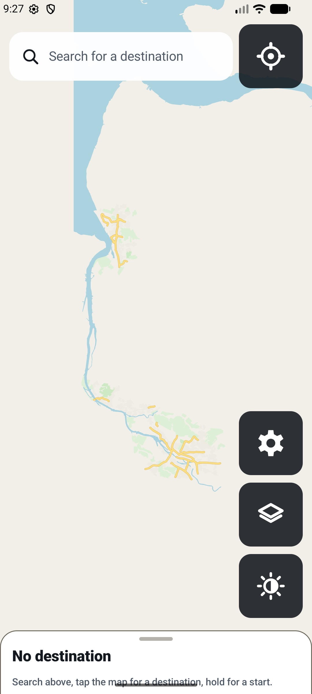
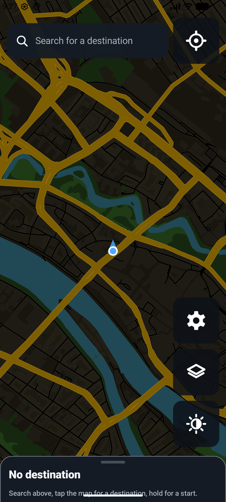
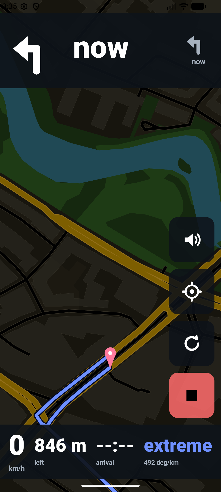

# OpenCurv

An offline, open-source motorcycle navigator for Android that routes for
**curves**, not for arrival time.

No account, no cloud, no tracking. **Riding is completely offline**: maps,
routing, rerouting and voice guidance all run on files stored on the phone, and
your position never leaves the device.

The app does have the `INTERNET` permission, for exactly one job — downloading
those files in the first place, so you do not have to move hundreds of megabytes
from a PC. That traffic is confined by an Android
[network security config](app/src/main/res/xml/network_security_config.xml) to
the two servers the data comes from, enforced by the platform rather than by our
own code, and downloads are refused while navigation is running.

---
## What it does

- **Destinations without a network.** Type a town, a village or a street and
  OpenCurv finds it instantly offline. The app bundles a starter index of German
  towns and major destinations (`places_de.tsv`) and supplements it with
  tab-separated `.places` databases downloaded alongside regional vector maps.
  Tapping the map still works, and a long press sets where the route starts, so
  a ride can be planned indoors with no GPS.
- **Curve-hungry routing.** BRouter runs on-device against `.rd5` routing tiles
  with our pre-calculated curve score (`opencurv:curve=0..15`) encoded directly
  into the road network. Purpose-built motorcycle profiles reward sweeping bends
  and sequential twisty sections while avoiding city grids, unpaved surfaces
  (unless Enduro profile is chosen), and penalizing high-speed motorways.
- **GPU-accelerated vector map (MapLibre Native).** High-performance vector
  rendering powered by MapLibre Native and local offline PMTiles archives
  (`pmtiles://file://`). No CPU rendering bottlenecks, smooth 60 fps panning
  and continuous true 3D camera pitch and rotation.
- **Designed for the cockpit.** Contrast-optimised Day and Night cartography
  crafted specifically for outdoor sunlight readability and night rides, with
  offline fontstacks bundled on the device.
- **A cockpit while riding, an app while standing.** The riding HUD keeps its
  104 dp maneuver arrow, $\ge 34$ sp high-contrast readouts and 84 dp controls
  sized for gloves on a bumpy road. Edge-to-edge window insets ensure safe
  margins around motorcycle handlebar mounts.
- **Motorcycle-tuned voice guidance.** Announcements trigger based on estimated
  time to turn (seconds instead of metres) adapting to riding speed. An acoustic
  chime wakes up Bluetooth helmet headsets (340 ms pre-roll) to eliminate
  chopped audio, and announcements are suppressed while banked in steep curves.
- **A map that stays where you put it.** Pan or pinch and the map stops
  following you; the recentre button lights up until you tap it.
- **A demo ride.** Calculate a route, tap *Demo ride*, and the app drives it on
  screen through the ordinary navigation pipeline: the HUD, the countdown, the
  rerouting logic and every spoken announcement, at the kitchen table.
- **German and English.** The interface and the announcements follow the phone's
  language ("In 10 Sekunden rechts abbiegen"), with English for everything else.
- **Rerouting that stays out of the way.** Off-route past 35 m for three
  consecutive fixes triggers a background recalculation with a cooldown and a
  failure backoff.
- **GPS that survives a handlebar mount.** A constant-velocity Kalman filter
  over a local tangent plane smooths position, speed and heading, snapped onto
  the route by a windowed map matcher.
- **Regions, not files.** Pick a region (e.g. "Bremen", "Niedersachsen", "Bayern")
  and OpenCurv fetches the PMTiles vector map, routing tiles (`.rd5`), and place
  indices directly from official OpenCurv GitHub Releases as a unified package.

## What it does not do

- **No house numbers, no postcodes.** Search finds places, towns, and street names,
  not individual house numbers.
- **No cloud dependency.** All navigation, routing, and search run strictly
  on-device without an internet connection once regional data is downloaded.

## Visuals

| Day Overview | Night Overview | 3D Cockpit HUD |
| :---: | :---: | :---: |
|  |  |  |

## Getting the offline data

### In the app (Recommended)

1. Open **Layers / Maps** → **Download maps**.
2. Select your desired region (e.g. German federal states).
3. OpenCurv downloads the `.pmtiles` vector map and all required `.rd5` routing
   tiles from the latest OpenCurv release catalog directly to your phone.

### What the app may talk to

Only `github.com` and `objects.githubusercontent.com`, exclusively over HTTPS,
and only when you explicitly request a map download. The host whitelist is
enforced at the platform level via
[`network_security_config.xml`](app/src/main/res/xml/network_security_config.xml).
Navigation and routing function 100% offline.

## Building

```bash
./gradlew assembleDebug        # app/build/outputs/apk/debug/app-debug.apk
./gradlew assembleRelease      # minified, signed release APK
```

Requires JDK 17 and the Android SDK (compileSdk 35). To preserve GitHub Actions
cloud compute minutes, APK binaries are assembled locally. The automated GitHub
Actions data pipeline (`opencurv-data.yml`) runs independently to process OSM
extracts, calculate curve scores, and generate PMTiles/RD5 release artifacts.

### Testing the logic without the Android SDK

Everything that can go subtly wrong — curve scoring, routing profiles, BRouter
integration, Kalman filtering, map matching, turn-by-turn state machine, and
place search — is tested on a plain JVM:

```bash
./gradlew -p tools/verifier test
./gradlew testDebugUnitTest
```

This build reads the app's own sources directly; there is no copy to drift out
of date. The same tests also run as Android unit tests via
`./gradlew testDebugUnitTest`.

## Tuning for a 4 GB phone (e.g. Galaxy A16)

The defaults are already set for this class of device:

| Setting | Value | Why |
|---|---|---|
| BRouter node cache | 48 MB (`NavigationController.MEMORY_CLASS_MB`) | Enough for a day-long route across several tiles without starving the renderer |
| Tile cache | 1.5× screen (`MapController.SCREEN_RATIO`) | On 4 GB the renderer competing with BRouter for heap is what causes stutter, not a cache miss |
| `android:largeHeap` | `false` | A large heap makes GC pauses longer, which is worse than a smaller cache |
| ABI filters | `armeabi-v7a`, `arm64-v8a` | Smaller APK, no unused native code |
| Release build | R8 minify + resource shrinking | Faster cold start on a mid-range SoC |

If routing across a large area is slow, import fewer `.rd5` tiles rather than
raising the memory class: BRouter's search cost scales with the area it has to
consider.

## Architecture

```
app/src/main/java/com/motoroute/
├── data/
│   ├── brouter/     BRouterEngine (offline routing), ProfileManager (.brf assets)
│   ├── download/    Region catalog, tile arithmetic, resumable HTTPS
│   │                downloader, the region-package index
│   ├── search/      Offline place search read out of the Mapsforge maps
│   ├── location/    LocationProvider (platform GPS, no Play Services), KalmanFilter
│   ├── map/         OfflineDataRepository (.map / .rd5 / .brf on disk)
│   ├── model/       Route, NavigationInstruction, Maneuver, Curviness
│   └── settings/    SettingsRepository
├── domain/
│   ├── geo/         Geo (distance, bearing, cross-track projection)
│   ├── MapMatcher       windowed projection onto the route
│   ├── NavigationManager  turn-by-turn state machine
│   ├── ReroutingEngine    off-route detection, single-flight, backoff
│   ├── CameraController   speed to zoom and tilt
│   ├── RouteSimulator     the demo ride, feeding the real pipeline
│   ├── guidance/          what the voice says, per language
│   └── NavigationController  wires location -> state machine -> voice
├── service/         NavigationService (location), DownloadService (data sync)
├── voice/           VoiceGuidance (platform TTS)
└── ui/              Compose: map, navigation HUD, route planning, search,
                     onboarding, settings, offline data
brouter/             vendored BRouter core (MIT) + one bridge class
tools/verifier/      JVM-only build that tests the core without the Android SDK
```

Navigation state lives in a process-scoped controller rather than a ViewModel,
so rotating the phone on the handlebar cannot interrupt a ride.

## Routing profiles

Three profiles ship in `app/src/main/assets/profiles/`:

| Profile | For |
|---|---|
| `motorcycle_curvy.brf` | The default. Hunts bends, avoids main roads, paved only |
| `motorcycle_fast.brf` | Direct route, motorways allowed |
| `motorcycle_enduro.brf` | Allows gravel, tracks and unpaved surfaces |

All three expose a `curviness` parameter (0 = direct, 2 = maximum curves) that
the "curve appetite" slider drives at runtime. They are plain BRouter profiles:
edit them, or import your own `.brf`, and the app picks it up.
`RoutingProfileTest` parses them with the real BRouter expression engine on every
build and asserts they still say what they claim — a typo in a profile does not
fail a build, it quietly sends you down the motorway.

## Licence

GPL-3.0 — see [`LICENSE`](LICENSE). Third-party components and map data
attribution are listed in
[`THIRD_PARTY_LICENSES.md`](THIRD_PARTY_LICENSES.md).

Map data © OpenStreetMap contributors, ODbL.
